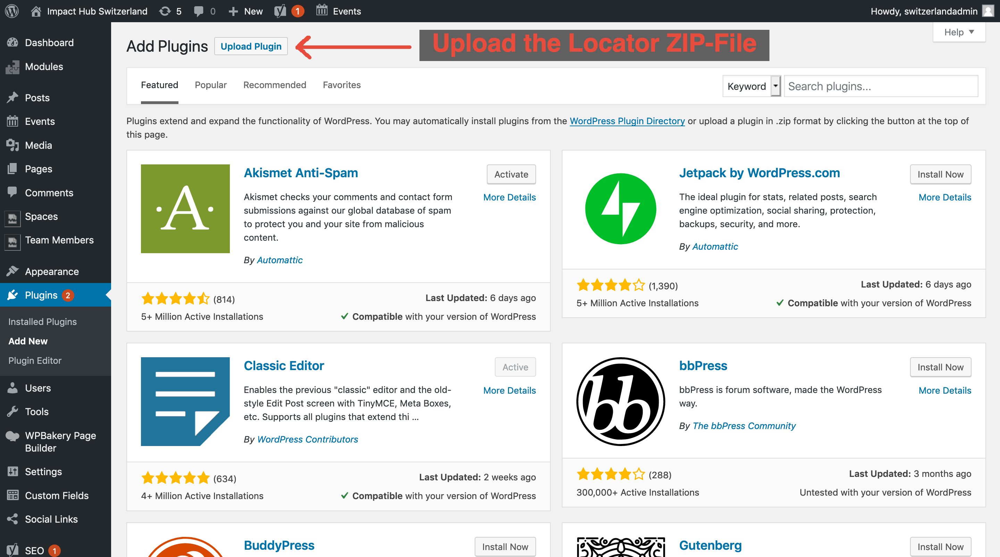
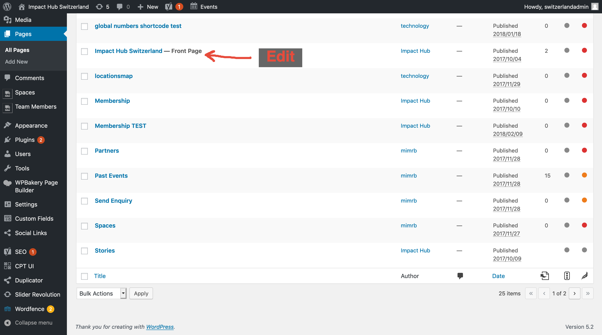
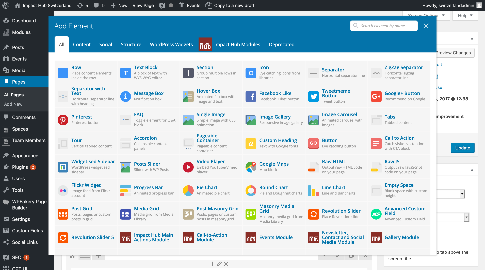
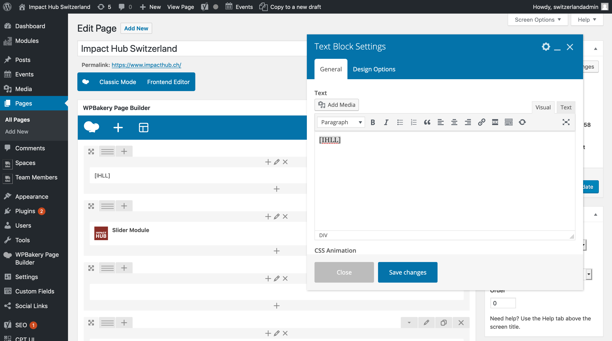

# Impact Hub Hub Locator Plugin

## Live Demo of inline Frame

[Live Demo](https://api.hub.panter.cloud/iframes/hubs)

## Usage

Edit your frontpage, switch to wordpress classic editor and insert the following:

```
[IHLL]
```

To specify the default hub:

```
[IHLL hub="zürich-kraftwerk"]
```
Find your location ID: https://docs.google.com/spreadsheets/d/1tLRn6KkaBUYH20PlBSNBo6RkvMnSTjlOUYg3yq8-jIo/edit#gid=0

If you want to open all links in a new tab, use this:

```
[IHLL openInNewTab="true"]
```

You can also change the color:

```
[IHLL color="#51C4F1"]
```

or all in one:

```
[IHLL hub="zürich-kraftwerk" openInNewTab="true" color="#51C4F1"]
```

## install

### Requirements
* A wordpress installation with a propper IH-Global wordpress template

### Getting Started
* Download latest version

#### Step 1


#### Step 2


#### Step 3


#### Step 3



